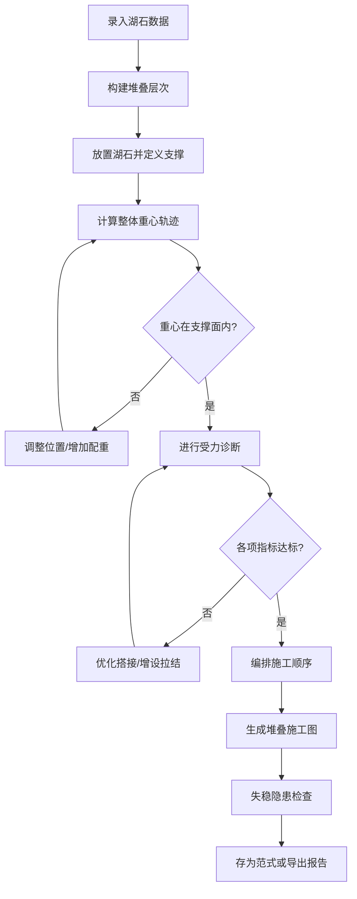

# 古典园林叠石假山稳定性分析系统 - 产品需求文档（PRD）

## 1. 产品概述

面向古典园林叠山营造从业者的专业生产力工具，通过工程力学计算与传统造园技艺相结合，实现叠石假山从设计、校核到施工全流程的数字化管控。解决传统叠山技艺中"凭经验判断、缺数据支撑、难安全追溯"的痛点，在传承"瘦皱漏透"审美范式的同时保障结构安全。

## 2. 核心功能

### 2.1 用户角色

| 角色 | 说明 | 核心权限 |
|------|------|----------|
| 叠山技师 | 一线假山施工人员 | 录入湖石数据、查看校核结果、生成施工图 |
| 园林设计师 | 方案设计人员 | 创建堆叠方案、调用范式库、审美评分 |
| 工程监理 | 质量安全监督 | 查看受力诊断、安全告警、导出报告 |

### 2.2 功能模块

1. **叠石录入页**：湖石基础信息库，录入体量重量、形状特征、纹理照片
2. **重心校核页**：多层堆叠重心轨迹计算，判断重心投影是否落于基底支撑面
3. **受力诊断页**：悬挑力矩、接触应力、拉结铁件/灌浆缝受力、地震/游人荷载安全系数
4. **施工堆叠页**：就位顺序记录、堆叠施工图生成、失稳隐患实时告警
5. **范式库页**：经典假山堆叠骨架存储、检索、调用、范式评分

### 2.3 页面详情

| 页面名称 | 模块名称 | 功能描述 |
|----------|----------|----------|
| 叠石录入页 | 湖石信息录入 | 编号命名、重量(kg)、三尺寸(长×宽×高)、体积计算、材质选择（太湖石/英石/黄石/灵璧石） |
| 叠石录入页 | 形状特征标注 | 瘦度系数、皴纹密度、孔洞率、轮廓复杂度、棱角评分、纹理方向 |
| 叠石录入页 | 石库列表管理 | 已录入湖石列表、搜索筛选、分组管理、批量导入导出 |
| 重心校核页 | 堆叠层次构建 | 逐层放置湖石、设置坐标位置、定义支撑关系、搭接点标注 |
| 重心校核页 | 重心轨迹可视化 | 3D坐标展示、每层重心位置、整体重心投影、基底支撑面多边形 |
| 重心校核页 | 稳定性判定 | 重心是否在支撑面内、偏心距计算、稳定裕度百分比、分级告警 |
| 受力诊断页 | 悬挑力矩校验 | 挑石/悬石识别、悬挑长度、倾覆力矩、压脚石配重核算 |
| 受力诊断页 | 接触应力分析 | 搭接点接触面积、法向应力、剪应力、压裂安全系数 |
| 受力诊断页 | 拉结与灌浆 | 铁件规格选择、拉结力计算、灌浆缝强度、受力分担比例 |
| 受力诊断页 | 工况模拟 | 游人荷载(3.5kN/m²)、地震烈度(6-9度)、倾覆安全系数计算 |
| 施工堆叠页 | 就位顺序管理 | 堆叠步骤编排、每步操作说明、重量累计校验 |
| 施工堆叠页 | 堆叠施工图 | 层次示意图、坐标标注、搭接详图、二维码定位 |
| 施工堆叠页 | 失稳告警中心 | 头重脚轻判定、单点支撑告警、悬挑超限、应力超限清单 |
| 范式库页 | 经典范式展示 | 环秀山庄、片石山房、豫园、个园等经典骨架卡片 |
| 范式库页 | 范式检索调用 | 按风格/规模/难度筛选、一键载入当前方案、参数化适配 |
| 范式库页 | 自定义范式 | 当前方案存为范式、命名标注、审美评分、分享导出 |
| 全局模块 | 审美协调度评分 | 瘦、皱、漏、透四维评分、整体协调度、加权总分 |

## 3. 核心流程

## 4. 用户界面设计

### 4.1 设计风格
- **主色调**：墨黛色(#1a1a2e)为底，辅以石青(#4a7c9b)、赭石(#a0522d)点缀，米白(#f5f1e8)为正文
- **辅助色**：松石绿(#4a9b83)表示安全通过，赭红(#c2410c)表示警告超标
- **字体**：标题采用宋体风格展示字体，正文使用易读的衬线体系
- **按钮风格**：圆角方形，微浮雕效果，悬停时呈现水墨晕染过渡
- **布局风格**：古典册页式布局，左侧竖排导航，主体为卷轴式内容区，辅以朱红印章式状态标签
- **图标风格**：线性图标配合飞白笔触，石纹肌理作背景装饰

### 4.2 页面设计概览

| 页面名称 | 模块名称 | UI元素 |
|----------|----------|--------|
| 叠石录入页 | 录入表单 | 卷轴式卡片表单、石纹纹理背景、朱红校验印章、重量/尺寸联动计算 |
| 重心校核页 | 3D可视化区 | SVG分层堆叠视图、重心轨迹连线、基底支撑面高亮、坐标网格 |
| 受力诊断页 | 指标仪表盘 | 环形进度条(安全系数)、力矩柱状图、应力热力图、分项清单列表 |
| 施工堆叠页 | 步骤时间线 | 垂直时间轴、每步石卡预览、告警角标、堆叠示意图 |
| 范式库页 | 范式卡片墙 | 水墨封面缩略图、标题题签、四维评分条、悬停展开详情 |

### 4.3 响应式设计
桌面客户端优先设计，最低适配分辨率 1440×900。左侧导航固定宽度 220px，主内容区自适应。关键计算面板固定高度配合内部滚动，确保校核指标始终可见。

### 4.4 数据可视化指导
- 重心校核：使用 SVG 绘制分层堆叠剖面图，用虚线连接各层重心形成轨迹
- 受力诊断：力矩/应力使用径向仪表盘，绿黄红三色分区指示安全等级
- 审美评分：四维雷达图，叠加"瘦皱漏透"坐标蛛网，覆盖参考范式的轮廓线
- 施工顺序：垂直甘特图样式，每步配有湖石小预览图与操作说明
