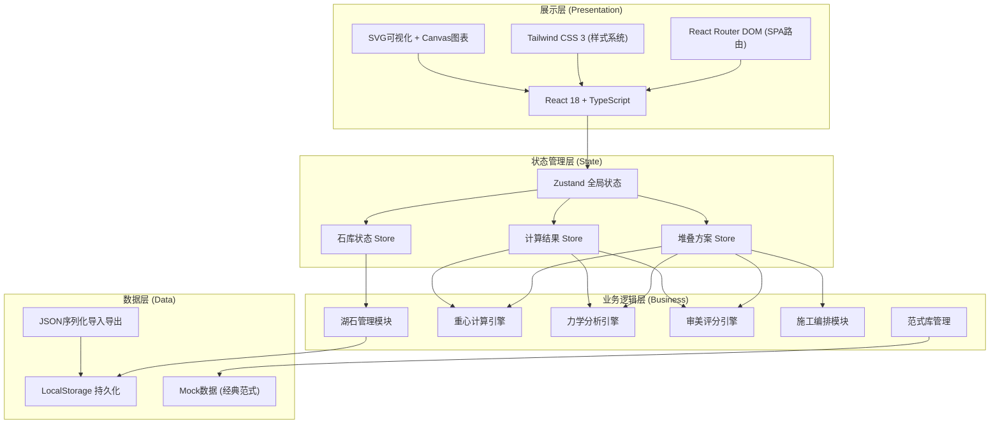
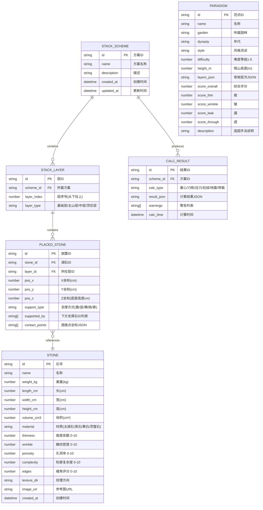

# 古典园林叠石假山稳定性分析系统 - 技术架构文档

## 1. 架构设计



## 2. 技术描述

- **前端框架**: React 18 + TypeScript (严格模式)
- **构建工具**: Vite 5 (极速冷启动、HMR)
- **样式方案**: Tailwind CSS 3 + PostCSS + 自定义CSS变量
- **路由管理**: React Router DOM v6
- **状态管理**: Zustand 4 (轻量级、不可变更新)
- **图标库**: Lucide React (线性图标，飞白风格适配)
- **数据持久化**: LocalStorage + Zustand Persist Middleware
- **数据可视化**: 原生 SVG (堆叠图) + 手写 Canvas (雷达图/仪表盘)
- **后端**: 纯前端方案，无需后端服务，数据存储于本地

## 3. 路由定义

| 路由 | 页面 | 说明 |
|------|------|------|
| `/stones` | 叠石录入页 | 湖石信息录入、石库管理 |
| `/center-of-gravity` | 重心校核页 | 堆叠构建、重心计算、稳定性判定 |
| `/stress-analysis` | 受力诊断页 | 力矩/应力/拉结/工况分析 |
| `/construction` | 施工堆叠页 | 就位顺序、施工图、失稳告警 |
| `/paradigm` | 范式库页 | 经典范式展示、检索、调用 |
| `*` | 重定向到 `/stones` | 默认入口 |

## 4. 数据模型

### 4.1 数据模型ER图



### 4.2 核心计算参数常量

```typescript
// 湖石材质密度 (kg/m³)
const MATERIAL_DENSITY: Record<StoneMaterial, number> = {
  TAIHU: 2400,   // 太湖石 (石灰岩)
  YING: 2650,    // 英石 (石英岩)
  HUANG: 2550,   // 黄石 (砂岩)
  LINGBI: 2700,  // 灵璧石 (变质岩)
}

// 岩石许用压应力 (MPa)
const ALLOWABLE_COMPRESSIVE_STRESS: Record<StoneMaterial, number> = {
  TAIHU: 25,
  YING: 60,
  HUANG: 40,
  LINGBI: 80,
}

// 灌浆缝许用强度 (MPa) - M30水泥砂浆
const GROUT_ALLOWABLE_STRESS = 12.0

// 拉结铁件规格
const TIE_SPECS = [
  { name: '4号镀锌铁丝', diameter_mm: 4, allowable_tension_kN: 5.5 },
  { name: '6号圆钢', diameter_mm: 6, allowable_tension_kN: 12.5 },
  { name: '8号圆钢', diameter_mm: 8, allowable_tension_kN: 28.0 },
  { name: '10号圆钢', diameter_mm: 10, allowable_tension_kN: 44.0 },
]

// 地震影响系数 (对应烈度6-9度)
const SEISMIC_COEFFICIENT = [0.04, 0.08, 0.16, 0.32]

// 游人活荷载标准值
const LIVE_LOAD_KN_M2 = 3.5

// 倾覆安全系数要求
const REQUIRED_OVERTURNING_SAFETY = 1.5
```

## 5. 目录结构

```
src/
├── assets/              # 静态资源（石纹、水墨背景）
│   └── textures/
├── components/          # 公共组件
│   ├── layout/         # 布局组件（导航、页头、侧边栏）
│   ├── StoneCard.tsx   # 湖石卡片
│   ├── GaugeMeter.tsx  # 仪表盘
│   ├── RadarChart.tsx  # 雷达图
│   └── SealStamp.tsx   # 印章组件
├── pages/              # 页面组件
│   ├── StoneEntry.tsx
│   ├── CenterOfGravity.tsx
│   ├── StressAnalysis.tsx
│   ├── Construction.tsx
│   └── ParadigmLibrary.tsx
├── store/              # Zustand状态
│   ├── stoneStore.ts
│   ├── stackStore.ts
│   └── resultStore.ts
├── utils/              # 工具与计算引擎
│   ├── geometry.ts         # 几何/重心计算
│   ├── mechanics.ts        # 力学分析
│   ├── aesthetics.ts       # 审美评分
│   └── construction.ts     # 施工编排
├── types/              # TypeScript类型定义
│   ├── stone.ts
│   ├── stack.ts
│   ├── paradigm.ts
│   └── calc.ts
├── data/               # Mock数据
│   ├── defaultStones.ts
│   └── paradigms.ts
├── App.tsx
├── main.tsx
└── index.css           # Tailwind入口 + 全局样式
```
